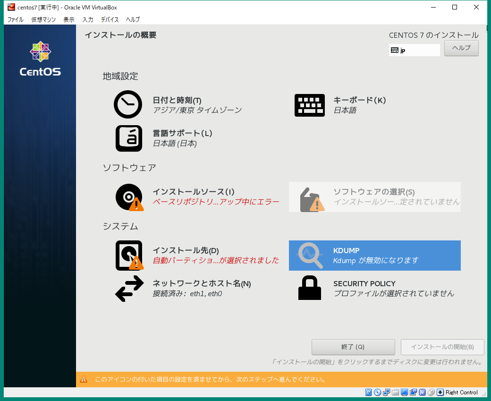

CentOS 7: 初期セットアップ手順
==============================

準備
----

以下の情報をネットワーク管理者に確認すること。 なお, SSH
鍵のパスフレーズは, 一般ユーザーのパスワードと同一とする。

-  ホスト名
-  IP アドレス
-  ネットマスク
-  デフォルトゲートウェイ
-  参照先 DNS サーバー
-  root パスワード
-  一般ユーザー名
-  一般ユーザーのパスワード

また, ISO ファイルを書き込むため, USB メモリーの貸与を受けること。

ISO ファイルダウンロード, 書き込み
----------------------------------

1. Web ブラウザーで `CentOS Project <https://www.centos.org/>`__
   にアクセスし, **Get CentOS Now** より DVD ISO
   をダウンロードするのが正攻法。
2. ただ, 回線が遅い場合があるので, `ミラーサイト
   (IIJ) <http://ftp.iij.ad.jp/pub/linux/centos/7/isos/x86_64/>`__
   にアクセスし, 最新の **NetInstall** な ISO
   ファイルをダウンロードする。(torrent じゃない方。)
3. Windows であれば,
   `Rufus <https://forest.watch.impress.co.jp/library/software/rufus/>`__
   をダウンロードし, USB メモリーに ISO ファイルを書き込む。

   -  ただし, 管理者権限が必要。
   -  なお, ファイル書き込みではなく,
      イメージ書き込みであることに注意すること。

OS インストール
---------------

1.  ISO ファイルを書き込んだ USB メモリーを筐体に挿し, 電源を投入する。
2.  **F12** キーなどを押下し, USB
    メモリーからインストーラーを起動する。(メーカー,
    機種によって押下するキーは異なる。)
3.  **Install CentOS 7** を選択する。

    -  |image0|

4.  検索欄に ``jap`` と入力し, **日本語 (日本)** を選択, **続行**
    ボタンを押下する。

    -  |image1|

5.  **ネットワークとホスト名** をクリックする。

    -  |image2|

    1. 画面左下の *ホスト名* 欄にホスト名を入力し, **適用**
       ボタンを押下, そのまま画面右側の **設定** ボタンを押下する。

       -  |image3|

    2. **全般** タブを開き,
       **この接続が利用可能になったときは自動的に接続する**
       にチェックを入れる。

       -  |image4|

    3. **IPv4 のセッティング** タブを開き, *方式* より **手動** を選択,
       **追加** ボタンを押下し, アドレス, ネットマスク, ゲートウェイ,
       DNS サーバーを入力, **保存** ボタンを押下する。 なお,
       インターネット接続用 NIC が別に存在する場合は,
       アドレスとネットマスクのみで OK.

       -  |image5|

    4. 画面右上のスライドが *オン* に変更されることを確認し, 画面左上の
       **完了** ボタンを押下する。

       -  |image6|

6.  **KDUMP** をクリックする。

    -  |image7|

    1. *kdump を有効にする* のチェックを **外し,** **完了**
       ボタンを押下する。

       -  |image8|

7.  **インストール先** をクリックする。

    -  |image9|

    1. そのまま **完了** ボタンを押下する。

       -  |image10|

8.  **日付と時刻** をクリックする。

    -  |image11|

    1. 画面右上の **歯車** ボタンを押下する。

       -  |image12|

    2. *稼働中* に緑のチェックが付いていることを確認し, **OK**
       ボタンを押下する。なお, どれか一つに付いていれば OK.

       -  |image13|

    3. 画面左上の **完了** ボタンを押下する。

       -  |image14|

9.  **インストールソース** をクリックする。

    -  |image15|

    1. インストールソースに
       ``ftp.iij.ad.jp/pub/linux/centos/7/os/x86_64`` と入力する。

       -  |image16|

    2. *追加のリポジトリー* の **プラス (+)** ボタンを押下し, 名前に
       ``updates``, URL に
       ``ftp.iij.ad.jp/pub/linux/centos/7/updates/x86_64`` と入力する。

       -  |image17|

    3. 更に *追加のリポジトリー* の **プラス (+)** ボタンを押下し,
       名前に ``extras``, URL に
       ``ftp.iij.ad.jp/pub/linux/centos/7/extras/x86_64`` と入力する。

       -  |image18|

    4. 画面左上の **完了** ボタンを押下する。

10. **ソフトウェアの選択** をクリックする。

    -  |image19|

    1. **最小限のインストール** が選択されていることを確認し, 画面左上の
       **完了** ボタンを押下する。

       -  |image20|

11. **インストールの開始** ボタンを押下する。

    -  |image21|

12. **ROOT パスワード** をクリックする。

    -  |image22|

    1. root パスワードを入力し, **完了** ボタンを押下する。

       -  |image23|

13. インストールが完了するまで待機する。

    -  |image24|

14. インストール完了後, **再起動** ボタンを押下する。

    -  |image25|

15. OS が起動し, ログインプロンプトが表示されることを確認する。

    -  |image26|

16. 最初に挿入した USB メモリーを抜く。

root ログイン
-------------

1. 自端末の Tera Term を起動する。
2. *ホスト* 欄に CentOS の IP アドレスを入力し, **OK**
   ボタンを押下する。

   -  |image27|

3. 初回接続時のみ, セキュリティ警告が表示されるが, そのまま **続行**
   ボタンを押下する。

   -  |image28|

4. *ユーザ名* に ``root``, パスフレーズに root のパスワードを入力し,
   **OK** ボタンを押下する。

   -  |image29|

5. root ユーザーのプロンプトが表示されることを確認する。

   -  |image30|

一般ユーザー作成
----------------

1. 一般ユーザーを作成する。

   -  ``# useradd -G wheel -N ryo-sato``

2. 一般ユーザーにパスワードを設定する。なお,
   **入力中のパスワードは表示されない** ので注意する。

   -  ``# passwd ryo-sato``

      -  ::

             ユーザー ryo-sato のパスワードを変更。
             新しいパスワード:           ## パスワードを入力する。
             新しいパスワードを再入力してください: ## パスワードを入力する。
             passwd: すべての認証トークンが正しく更新できました。

3. 一般ユーザーが作成されたことを確認する: *no such user*
   と表示されなければ OK.

   -  ``# id ryo-sato``

      -  ::

             uid=1000(ryo-sato) gid=100(users) groups=100(users),10(wheel)

4. ログアウトする。

   -  ``# exit``

5. 一般ユーザーでログインする。

SSH 鍵 (秘密鍵・公開鍵) 生成
----------------------------

1. SSH 鍵を生成する。

   -  ``$ ssh-keygen -t ed25519``

      -  ::

             Generating public/private ed25519 key pair.
             Enter file in which to save the key (/home/ryo-sato/.ssh/id_ed25519):   ## ココはそのまま Enter.
             Created directory '/home/ryo-sato/.ssh'.
             Enter passphrase (empty for no passphrase): ## パスフレーズを入力する。
             Enter same passphrase again:            ## パスフレーズを入力する。
             Your identification has been saved in /home/ryo-sato/.ssh/id_ed25519.
             Your public key has been saved in /home/ryo-sato/.ssh/id_ed25519.pub.
             The key fingerprint is:
             SHA256:PIUA2ZXwuFUhnQ54Y7kORVxBM2G1hQ11lZ7yfGCIm1Q ryo-sato@centos7
             The key's randomart image is:
             +--[ED25519 256]--+
             |    .+o*+*@*o=o =|
             |    . o+X=ooEo.o |
             |      .++=.o... .|
             |      .+..+ ..oo |
             |      .oS. o .+. |
             |        ..o    o.|
             |                .|
             |                 |
             |                 |
             +----[SHA256]-----+

公開鍵登録
----------

1. 公開鍵を登録する。

   -  ``$ ssh-copy-id localhost``

      -  ::

             /usr/bin/ssh-copy-id: INFO: Source of key(s) to be installed: "/home/ryo-sato/.ssh/id_ed25519.pub"
             The authenticity of host 'localhost (::1)' can't be established.
             ECDSA key fingerprint is SHA256:QpFLRM8JHPy5gVhjyPhIwaM+iAcWY/tzd0zK2+7We8M.
             ECDSA key fingerprint is MD5:26:ec:2f:aa:0c:09:47:91:a1:e9:af:6e:91:e0:03:e0.
             Are you sure you want to continue connecting (yes/no)?  ## yes と入力する。
             /usr/bin/ssh-copy-id: INFO: attempting to log in with the new key(s), to filter out any that are already installed
             /usr/bin/ssh-copy-id: INFO: 1 key(s) remain to be installed -- if you are prompted now it is to install the new keys
             ryo-sato@localhost's password:  ## パスワードを入力する。

             Number of key(s) added: 1

             Now try logging into the machine, with:   "ssh 'localhost'"
             and check to make sure that only the key(s) you wanted were added.

2. Tera Term の **ファイル** - **SSH SCP** より,
   秘密鍵をダウンロードする。

   1. ポップアップ下部の *From:* 欄に **.ssh/id_ed25519** と入力する。
   2. 同様に *To:* 欄右の **…** ボタンを押下し,
      ダウンロード先フォルダを指定する。
   3. **Receive** ボタンを押下する。

3. Tera Term の **ファイル** - **新しい接続** より,
   秘密鍵でログインできることを確認する。

sshd 設定変更
-------------

1.  作業ディレクトリーを変更する。

    -  ``$ cd /etc/ssh; pwd``

2.  設定ファイルをバックアップする。

    -  ::

           $ sudo cp -aiv sshd_config sshd_config.`date +%Y%m%d`

3.  設定ファイルがバックアップされたことを確認する: パーミッション,
    オーナー, グループ, タイムスタンプ, コンテキストが同一であれば OK.

    -  ::

           $ ls -l sshd_config sshd_config.`date +%Y%m%d`

       -  ::

              -rw-------. 1 root root 3907 10月 20 06:52 sshd_config
              -rw-------. 1 root root 3907 10月 20 06:52 sshd_config.20180410

    -  ::

           $ ls -Z sshd_config sshd_config.`date +%Y%m%d`

       -  ::

              -rw-------. root root system_u:object_r:etc_t:s0       sshd_config
              -rw-------. root root system_u:object_r:etc_t:s0       sshd_config.20180410

4.  設定ファイルを編集する。

    -  ``$ sudo vi sshd_config``

5.  差分を確認する。

    -  ::

           $ sudo diff -u sshd_config.`date +%Y%m%d` sshd_config

       -  .. code:: diff

              --- sshd_config.20180410        2017-10-20 06:52:25.000000000 +0900
              +++ sshd_config 2018-04-10 14:24:08.699437905 +0900
              @@ -35,7 +35,7 @@
               # Authentication:

               #LoginGraceTime 2m
              -#PermitRootLogin yes
              +PermitRootLogin no
               #StrictModes yes
               #MaxAuthTries 6
               #MaxSessions 10
              @@ -60,9 +60,8 @@
               #IgnoreRhosts yes

               # To disable tunneled clear text passwords, change to no here!
              -#PasswordAuthentication yes
              -#PermitEmptyPasswords no
              -PasswordAuthentication yes
              +PasswordAuthentication no
              +PermitEmptyPasswords no

               # Change to no to disable s/key passwords
               #ChallengeResponseAuthentication yes
              @@ -98,7 +97,7 @@
               #AllowAgentForwarding yes
               #AllowTcpForwarding yes
               #GatewayPorts no
              -X11Forwarding yes
              +X11Forwarding no
               #X11DisplayOffset 10
               #X11UseLocalhost yes
               #PermitTTY yes
              @@ -112,7 +111,7 @@
               #ClientAliveInterval 0
               #ClientAliveCountMax 3
               #ShowPatchLevel no
              -#UseDNS yes
              +UseDNS no
               #PidFile /var/run/sshd.pid
               #MaxStartups 10:30:100
               #PermitTunnel no

6.  現在のサービスの状態を確認する: *active (running)* であれば OK.

    -  ``$ sudo systemctl status sshd -l``

       -  ::

              ● sshd.service - OpenSSH server daemon
                 Loaded: loaded (/usr/lib/systemd/system/sshd.service; enabled; vendor preset: enabled)
                 Active: active (running) since 火 2018-04-10 13:36:17 JST; 48min ago
                   Docs: man:sshd(8)
                         man:sshd_config(5)
               Main PID: 1016 (sshd)
                 CGroup: /system.slice/sshd.service
                         mq1016 /usr/sbin/sshd -D

               4月 10 13:36:17 centos7 systemd[1]: Started OpenSSH server daemon.
               4月 10 13:48:53 centos7 sshd[1352]: Accepted password for root from 192.168.56.1 port 53782 ssh2
               4月 10 14:04:14 centos7 sshd[1463]: Accepted password for ryo-sato from 192.168.56.1 port 53932 ssh2
               4月 10 14:12:47 centos7 sshd[1515]: Connection closed by ::1 port 36190 [preauth]
               4月 10 14:12:47 centos7 sshd[1523]: Connection closed by ::1 port 36192 [preauth]
               4月 10 14:12:51 centos7 sshd[1534]: Accepted password for ryo-sato from ::1 port 36194 ssh2
               4月 10 14:16:00 centos7 sshd[1573]: Accepted publickey for ryo-sato from 192.168.56.1 port 53977 ssh2: ED25519 SHA256:PIUA2ZXwuFUhnQ54Y7kORVxBM2G1hQ11lZ7yfGCIm1Q
               4月 10 14:20:37 centos7 sshd[1598]: Received disconnect from 192.168.56.1 port 53999:11: authentication cancelled [preauth]
               4月 10 14:20:37 centos7 sshd[1598]: Disconnected from 192.168.56.1 port 53999 [preauth]
               4月 10 14:20:59 centos7 sshd[1600]: Accepted publickey for ryo-sato from 192.168.56.1 port 54000 ssh2: ED25519 SHA256:PIUA2ZXwuFUhnQ54Y7kORVxBM2G1hQ11lZ7yfGCIm1Q

7.  サービスを再起動する。

    -  ``$ sudo systemctl condrestart sshd``

8.  サービスが再起動されたことを確認する: *active (running)* であれば
    OK.

    -  ``$ sudo systemctl status sshd -l``

       -  ::

              ● sshd.service - OpenSSH server daemon
                 Loaded: loaded (/usr/lib/systemd/system/sshd.service; enabled; vendor preset: enabled)
                 Active: active (running) since 火 2018-04-10 14:25:46 JST; 4s ago
                   Docs: man:sshd(8)
                         man:sshd_config(5)
               Main PID: 1652 (sshd)
                 CGroup: /system.slice/sshd.service
                         mq1652 /usr/sbin/sshd -D

               4月 10 14:25:46 centos7 systemd[1]: Starting OpenSSH server daemon...
               4月 10 14:25:46 centos7 sshd[1652]: Server listening on 0.0.0.0 port 22.
               4月 10 14:25:46 centos7 sshd[1652]: Server listening on :: port 22.
               4月 10 14:25:46 centos7 systemd[1]: Started OpenSSH server daemon.

9.  Tera Term の **ファイル** - **新しい接続** より,
    パスワード認証でログインでき **ない** ことを確認する。
10. 同様に, Tera Term の **ファイル** - **新しい接続** より, root
    ユーザーでログインでき **ない** ことを確認する。

どっとはらい。

.. |image19| image:: _static/WS000027.PNG

.. |image27| image:: _static/WS000036.PNG

